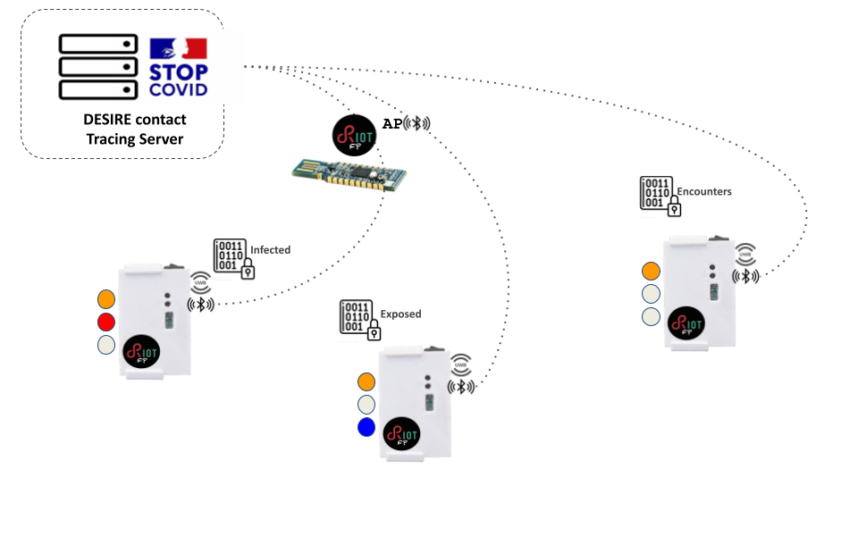

# PEPPPER Demo

This application runs PEPPER (PrEcise Privacy-PresERving Proximity Tracing) and adding the required futures to run with [desire CoAP server](https://gitlab.inria.fr/pepper/desire-coap-server) in non-secured mode.

In a nutshell devices advertise unique identifiers over BLE
and scan looking for other nodes performing those advertisements. Once a node
is "seen" (enough EBID slices have been scanned to be able to reconstruct it)
then TWR (two way raging) requests are exchanged between those devices to
determine their distance. If a device is seen for enough time and at a close
enough distance then its determined to be a relevant encounter and PET (Private
Encounter Tokens) are generated.

The EBID slice is rotated according to `ADV_PER_SLICE` (default 10).
Every `EPOCH_DURATION_SEC` (default `300s`) the EBID is reset and an
epoch ends. At the end of an epoch all EBID seen for more than `MIN_EXPOSURE_TIME`
(default `150s`) and under `MAX_DISTANCE_CM` (default 200cm) trigger PET
calculation.

Different than the base application `pepper_srv_coap`, which adds IPV6 connectivity allowing
devices to offload the ERTL tables as well as notify and get information on
their infection/exposure status.

|  |
|:-------------------------------------------------------------------------------:|
|                          *Demo Architecture Overview*                           |

For the above:

* a BLE border router needs to be deployed
* a DESIRE CoAP server needs to be deployed and provisioned with EDHOC credentials
(if used)

## Setup

### Basic Setup (IPv6)


* Provision 2 or more dwm1001 devices

```
$ make -C apps/pepper_demo flash term
```

* Deploy a Border Router

Any RIOT based border router will do, so choose on a BLE capable device any
configuration as described in [gnrc_border_router](../../RIOT/examples/gnrc_border_router/README.md).

For convenience a `cdc-ecm` border router is used here on a `nrf52540-mdk-dongle`.
Its important to include the `nimble_autoconn_ipsp` module. If using `DHCPV6`
`STATIC_ROUTES` are used, otherwise something like `radvd` can be configured.

Bootstrap the border router and keep the terminal open:

```
$ STATIC_ROUTES=1 USE_DHCPV6=0 UPLINK=cdc-ecm USEMODULE="nimble_autoconn_ipsp" BOARD=nrf52840-mdk-dongle make -C RIOT/examples/gnrc_border_router/ flash term
```

The border router should get a globally routable address (if this is the first
time Kea will need to be installed).

```
Iface  9  HWaddr: FE:32:2A:89:4B:8D
          L2-PDU:1500  MTU:1500  HL:64  RTR
          Source address length: 6
          Link type: wired
          inet6 addr: fe80::fc32:2aff:fe89:4b8d  scope: link  VAL
          inet6 addr: fe80::2  scope: link  VAL
          inet6 group: ff02::2
          inet6 group: ff02::1
          inet6 group: ff02::1:ff89:4b8d
          inet6 group: ff02::1:ff00:2
Iface  7  HWaddr: FF:69:5A:5A:17:95
          L2-PDU:1280  MTU:1280  HL:64  RTR
          RTR_ADV  6LO  IPHC
          Source address length: 6
          Link type: wireless
          inet6 addr: fe80::ff69:5aff:fe5a:1795  scope: link  VAL
          inet6 addr: 2001:db8:0:2:ff69:5aff:fe5a:1795  scope: global  VAL
          inet6 group: ff02::2
          inet6 group: ff02::1
          inet6 group: ff02::1:ff5a:1795
```

From host:

```
ping6 2001:db8:0:2:ff69:5aff:fe5a:1795
PING 2001:db8:0:2:ff69:5aff:fe5a:1795(2001:db8:0:2:ff69:5aff:fe5a:1795) 56 data bytes
64 bytes from 2001:db8:0:2:ff69:5aff:fe5a:1795: icmp_seq=1 ttl=64 time=1.84 ms
64 bytes from 2001:db8:0:2:ff69:5aff:fe5a:1795: icmp_seq=2 ttl=64 time=1.04 ms
64 bytes from 2001:db8:0:2:ff69:5aff:fe5a:1795: icmp_seq=3 ttl=64 time=0.992 ms
^C
--- 2001:db8:0:2:ff69:5aff:fe5a:1795 ping statistics ---
3 packets transmitted, 3 received, 0% packet loss, time 2003ms
rtt min/avg/max/mdev = 0.992/1.289/1.839/0.388 ms
```

* Deploy the CoAP server


```
git clone https://gitlab.inria.fr/pepper/desire-coap-server.git
cd desire-coap-server
pip install -r requirements.txt
```

Recover the devices identifiers (this can be done by flashing the devices
and using the `id` shell command):

```
> id
dwm1001 id: DW5FC2
```

Then start the coap server declaring all devices to enroll, eg:

```
python desire_coap_srv.py --node-uid DW5FC2 DWED75
```

### Running the Demo

With everything setup the demo can be started, devices will begin advertising
their EBID and an scanning for neighboring tokens advertising theirs, once
a neighbor is discovered TWR (two way ranging requests begin). Different than
the [basic pepper examples](../pepper_simple) if there is IPV6 connectivity the devices
will periodically fetch the exposure status as well as offloading there ERTL
tables:

On devices:

```
[pepper_srv] coap: fetch esr at /DW5FC2/esr
[pepper]: end of uwb_epoch
[pepper]: process all uwb_epoch data
[pepper]: new uwb_epoch t=246
[pepper]: new ebid generation
[pepper]: local ebid:
      0xa6 0x1e 0xbc 0xe5 0x84 0x54 0x12 0xde
      0xbe 0xa0 0x90 0x05 0x4b 0xeb 0x32 0x44
      0xa5 0x81 0xdb 0x27 0x6a 0x83 0x4e 0x90
      0xc1 0xe8 0x37 0x61 0x86 0x93 0xc2 0x68
[pepper]: start adv: 60 times with intervals of 1000 ms
[pepper]: enable TWR with addr 0x41fdms
[pepper]: start scanning for 60000ms
[pepper_srv] coap: send ertl to /DW5FC2/ertl
```

On server:

```
CoAP Server Start
coap-server:resources - CoAP Server Start
   coap-server - [exposure_status]: uid=DWAFDE is_exposed=(False)
   coap-server - [exposure_status]: uid=DW5FC2 is_exposed=(False)
   coap-server - [exposure_status]: uid=DWAFDE is_exposed=(False)
   coap-server - [exposure_status]: uid=DW5FC2 is_exposed=(False)
   coap-server - [pet_offloading]: received rtl from uid=DWAFDE
{
  "epoch": 188,
  "pets": [
    {
      "pet": {
        "etl": "",
        "rtl": "ZSg6zLibenDDN6co0sVXvYJmTJRHo9Mb3kfUsdLwKwg=",
        "uwb": {
          "exposure": 50,
          "req_count": 31,
          "avg_d_cm": 37
        }
      }
    }
  ]
}
```

If a device is declared positive (by pressing the user button) then the server is
notified and then devices that where in contact should see this and change their
status LED:

The infected device:

```
[pepper_srv] coap : serialize infected=true, len=(5)
[infected_declaration]: COVID positive!

```

The server:

```
   coap-server - [infected_declaration]: uid=DWAFDE is_infected=(True)
   coap-server - [exposure_status]: uid=DW5FC2 is_exposed=(True)
```

The exposed device:

```
[exposure_status]: COVID contact!
```

