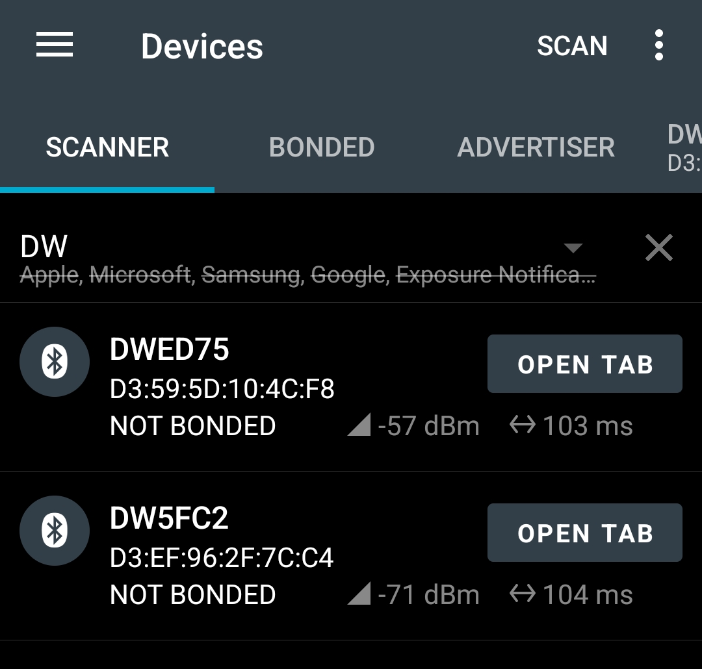
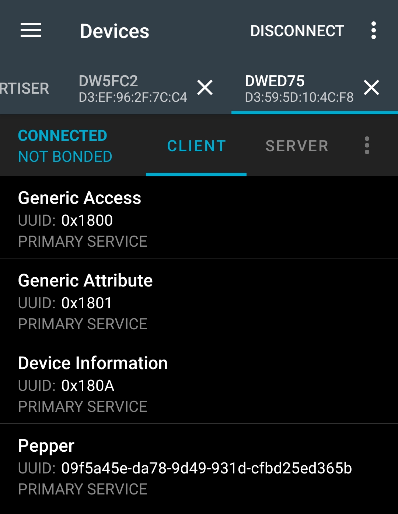
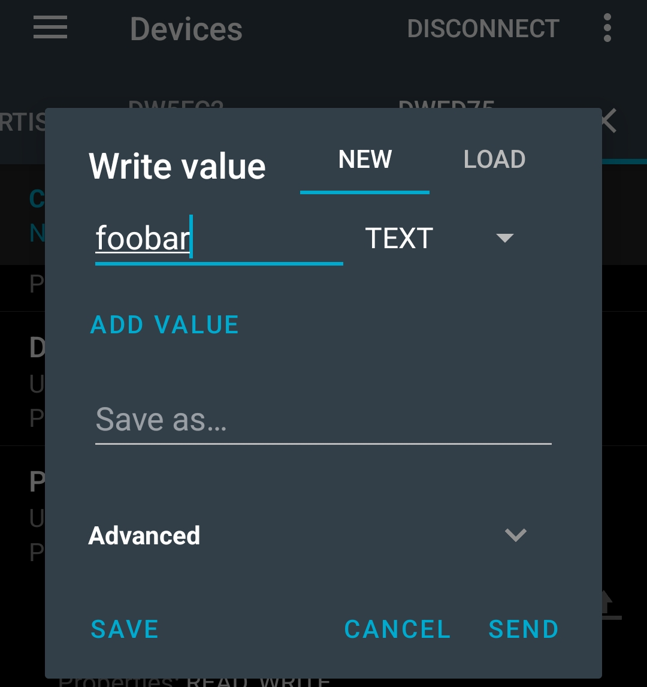

# PEPPER Low Power Application

This implements PEPPER (PrEcise Privacy-PresERving Proximity Tracing) in a headless
manner leveraging the `pepper_gatt` module to configure and start PEPPER.

At the end of of an epoch information on the encounters is logged over serial
or to an attached SDCARD, if any is present.

Additionally it enables `twr_sleep` putting the UWB radio to sleep when unused.

Its also making the `dwm1001` devices user button stop/start  advertising
its GATT services.

To easily identify exchanges static CID are used it can be overridden
in the application [Makefile](Makefile) or at compile time by setting `STATIC_CID`
to 0 or 1.

## PRE-requisites

- [DWM1001 Development Board](https://www.decawave.com/product/dwm1001-development-board/)
- Install [nRF Connect For Mobile](https://www.nordicsemi.com/Products/Development-tools/nRF-Connect-for-mobile/GetStarted)
- Hooked up SD-CARD, suggested to use this [SD Breakout](https://gitlab.inria.fr/pepper/dwm1001_sdcard_bb)

## Optional PRE-requisites

- Battery: [Accu LiPo 3,7 Vcc 250 mAh PR382527](https://www.gotronic.fr/art-accu-lipo-3-7-vcc-250-mah-pr382527-30027.htm)
- [DWM1001 Development Board Case](https://gitlab.com/Inria-Chile/Atelier-Inria/dwm-rtls/-/tree/master/enclosures)

Currently devices are not time synchronized so if the `MIN_EXPOSE_TIME_S`
is too large with respect to `CONFIG_EPOCH_DURATION_SEC` they might miss each
other. A BLE time advertiser can be set up to synchronize devices. See
[../../tests/time_server/README.md].

## Workflow

On boot the device will be idle, it will not be advertising its services
and PEPPER will not be running.

1. Press the second button on the `dwm1001` board (the first one is the nRST),
a blue led should turn on meaning its started advertising.

1. In nRFConnect go to Devices>Scanner, and start scanning, you should see one
or more `DWXXXX` devices. Connect to them.

Among others the PEPPER service should show up (look for
`09f5a45e-da78-9d49-931d-cfbd25ed365b`, you can long-hold on the service
to rename it to something easy to recognize).

1. Select the PEPPER service, 4 characteristics should show up:

    - `ce2ae1d5-b967-c348-985a-ba2f2b0ac8d0` (configure): read/write characteristic to configure
        the basename
    - `ce2ae1d5-b967-c348-985a-ba2f2b0ac8d1` (start): write characteristic to start pepper, all
    required fields must be provided (see PEPPERStart python class)
    - `ce2ae1d5-b967-c348-985a-ba2f2b0ac8d2` (stop): write characteristic to stop
    pepper, it will ignore whatever data is sent and simply stop PEPPER.
    - `ce2ae1d5-b967-c348-985a-ba2f2b0ac8d3` (restart): write characteristic to
    restart PEPPER with default parameters, it will ignore whatever data is sent.

    _Note_: just as for the service you can rename the characteristics to something
    easy to identify

1. Write a value to the `configure` characteristic, e.g.: `foobar`, future logs
will be tagged with this value, helping to identify them.

1. Write any dummy value to the `restart` characteristic, or a byte-array holding
the configuration for the `start` characteristic.

1. Stop advertising the GATT service by pressing the second button again, the blue
led light should disappear.

1. Repeat steps 2-4 as needed
