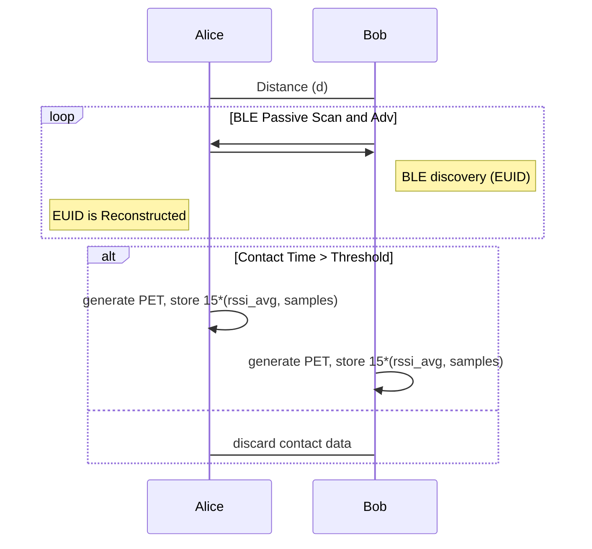
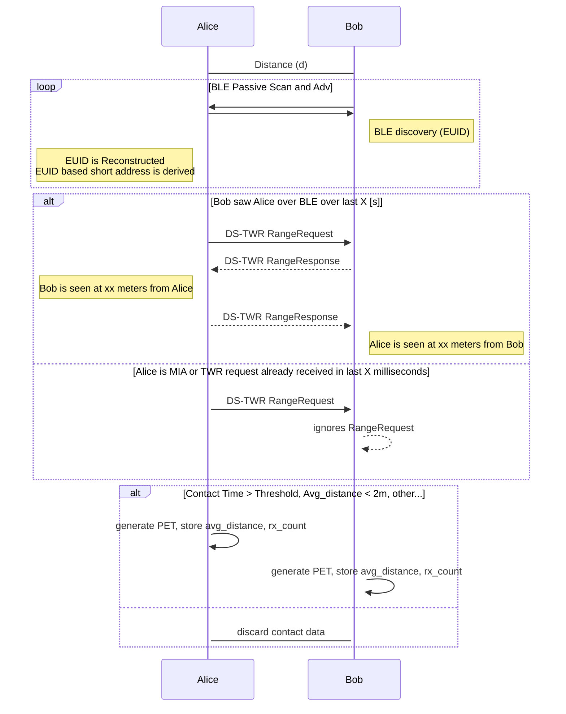

# :hot_pepper: PEPPER

DISCLAIMER: everything in this document is up for discussion and is only meant as a starting point, at this stage it is not intended to be thourough.

1. [Summary](#summary)
1. [Objectives](#objectives)
1. [Proximity Discovery](#proximity-discovery)
1. [Exposure Status Request](#exposure-status-request)
1. [Challenges](#challenges)
1. [Metrics Analysis](#metrics-analysis)

## Summary

:hot_pepper: PEPPER want's to improve on the DESIRE contact tracing protocol effectivenes by improving on the [DESIRE] equivalent **Proximity Discovery** and **Exposure Status Request** phases. While also allowing a token ("smarpthone-free") compatible solution.

The main aspect is to include Ultra Wide Band (UWB) Time-Off-Flight (ToF) information. With UWB an ~accurate distance value can be obtained which can replace the probabilistic approach described in [ROBERT-DESIRE-BLE-RSSI-algorithm]. This can potentially allow for additional pre-processing to happen on the device and reduce upstreamed data.

A series of relevant metrics (see [DESIRE-metrics]) have been intially defined to characterize the proposed solution against the baseline.

### Terminology

**DESIRE-token**: Vanilla DESIRE compliant implementation on a Token. The base line on which to improve.

**PEPPER-token**: Contact tracing protocol implementation on a Token. Explore improvements regarding to DESIRE on one or many [DESIRE-metrics].

**UWB**: ultra wide band
**ToF**: time of flight
**TWR**: two way ranging
**SS-TWR**: single sided two way ranging
**DS-TWR**: double sided two way ranging

### Use Cases

To be completed?

#### Potential Use cases

* Carry period:
    * Short-carry:
        * e.g. Large venue concert when you pick-up at entrance and leave the token at exit?
    * Long-carry:
        * e.g. token is carried by person for e.g. 15+ days

* Notification:
    * via app/phone
    * via token itself
    * pull/push

* Role of phone:
    * phone <=> backend server
    * token <=> phone (accesspoint) <=> backend server
    * token <=> phone app <=> backend server
    * token <=> backend server (via LoRa? or via BLE accesspoint on home router?)

#### PEPPER aimed use cases (for now)

Embedded long-term carry token. Notifications are received directly in the token through
an oportunistic accesspoint (phone, home router, etc).

TODO => **User requirements! Security/privacy requirements!**

### Context

*These are ballpark numbers extracted from dw1000 datasheet/application notes as well as
nrf52832 datasheet (hardware embedded in the [DWM1001] modules).*

BLE (nrf52832):
* Data rate: 1Mbps
* TX average current: ~7.1mA
* RX average current: ~6.0mA
* RX time (scan window): ~10 * (TX time)
* TX time: ~320us/packet * 3 (channels)
* Available Payload: 24 bytes in advertisement

UWB (dw1000):
* Data rate: 6.8 Mbps
* TX average current: ~111mA
* RX average current: ~134mA
* RX time: ~215us/packet
* TX time: ~200us/packet
* Available Payload: IEEE802154 frame 127 bytes - TWR timestamps(8 bytes)

=> UWB may consume more power than BLE and therefore it makes sense to leverage BLE to optimize when the UWB radio is used and turned on.

## Objectives

(To be completed.)

Improve the protocol effectiveness:

1. Improve the false negatives/positives
1. Improve the protocol adoption

(1) Is mainly defined by the properties of the wireless signal used in the infectiousness model.
(2) Can be improved by:
* reducing the cost of entry
* improving the device autonomy
* maintaining similar privacy protection properties

Metrics from  [DESIRE-metrics] relating to the above objectives are:

**False negatives/positives**
* Axis: Contact Estimation
    * Distance estimation precision
    * Performance in dense environments
    * Synchronization (two nodes see same encounter)

**Protocol adoption**
* Axis: Energy Efficiency
* Axis: Data Storage and Transmission
* Axis: Privacy Analysis

## Proximity Discovery

### DESIRE

### PEPPER

Assumptions:
* devices are roughly synchronized so that EUID generation is roughly in sync
* UWB channel hopping is ignored (but could be encoded in BLE metadata)

**Overview**

0. Bootstraping
    * Each device periodically generates an ephemeral unique identifier (EUID), same as for DESIRE
    * A short-address is generated from that ephermeral unique identifier
0. Encounter Discovery
    * Devices advertise over BLE TWR-activity support. Two options can be used for the advertisement payload:
        * a) Advertise the short-address
        * b) Advertise EUID slice as in [DESIRE] (this would make PEPPER [DESIRE] compatible)
    * Devices scan over BLE for devices supporting TWR-activity. Depending on the above a device is considered discovered when either:
        * a) An amount of advertisement packets for a short-address are received
        * b) An EUID is reconstructed and short-address is derived
    * Device continues to scan and advertise to:
        * Look for new devices
        * Determine if a seen device dissapeared (turn-off TWR-activity)
        * As a mean to synchronize reception?
0. To be determined: Handshake
    * ...
0. TWR-Activity
    * TWR-activity: Every X time a DS-TWR request is scheduled at a random offset between TWR_P (offset could be based on the EUID)
        * TWR-activity is re-scheduled as long as device is still "visible over BLE"
    * ToF/distance estimation from a range request are filtered out based on d<2m. Values of d<2m are lineary averaged over the number of samples
    * At the end of an epoch for all seen devices:
        * If the exposure time is enough then PETs are calculated and stored on the device
        * If a risk score can be calculated locally then only that value is stored, otherwise the device stores:
            * exposure time
            * average distance
            * range requests counts

## Exposure Status request

Depending on how a UWB risk score is calculated there are two options:
1, risk score can be efficiently calculated on devices
2. risk score needs to be calculated upstream

If (1) then PEPPER can be inherently decentralized.
If (2) this step is as in [DESIRE] but the relayed information is smaller since windowing is not needed since shadowing and multipath-fdading is much lower in UWB.

## Challenges

### Performance

#### Synchronize TX and RX UWB activity

TWR-DS requests can be sent out at a known offset based on the the last BLE advertisement received. BLE Tof is around 200us, so this can give a rough estimate of Tadv(time of the advertisement).

Options:
* TWR_delay = Tadv + KNOWN_VALUE
* TWR_delay = (EUID[0] + EUID[1]) % (MS_PER_SEC) + Tadv

A potential receiver would turn on the radio around that time.

#### Dense scenarios

* How to limit collisions in dense environments?
* UWB aloha limit on ~1.7k devices blinking every second
    * Can this be reduced by tuning TX power? Does this impact ToF estimation?
    * How often should a device blink?
* Use passive ranging to estimate position of node B if hearing a TWR exchange between A and B, when position on A is lously known?

#### Risk-score algorithm based on distance estimation

* How to best use ToF UWB estimation
* Feasibility generating a single value/risk score on device
* Feasibility of using a single value/risk score on device

### Security Threats

#### Use distance estimation to track device across EBID changes

Although PET-EBID can't be correlated. A malicious user with a large deployment of uwb "anchors" could perform path inference based on emmited UWB signals.
=> more precise distance estimation could lead to easier linking of subsequent EBID changes => Easier tracking of individuals across EBID changes?

#### Spamming attacks

A malicious user could continously request two-way-ranging with a given device and pollute all available channles rendering the protocol ineffective. This comes at a smaller cost thant in DESIRE since it can exploit other devices to do so.

## Metrics Analysis

|                                    |                                               DESIRE-token                                              |                                                           PEPPER-token                                                          |
|:----------------------------------:|:-------------------------------------------------------------------------------------------------------:|:-------------------------------------------------------------------------------------------------------------------------------:|
|          Wireless Signale          |                                                   BLE                                                   |                                                            BLE + UWB                                                            |
|        **Energy Efficiency**       |                                                                                                         |                                                                                                                                 |
|        Data processing time        |                             Expensive floating point arithmetics ~170us/msg                             |                                             Cheap floating point arithmetics TBD/msg                                            |
|          Time spent RX/TX          |  BLE Independent of contacts BLE_TX: ~320us/packet * 3(channels) BLE_RX: ~10 * BLE_tx (scanning window) | BLE Independent of contacts UWB Scales linearly with the number of contacts ?/epoch TWR_RX: ~215us/packet TWR_TX: ~200us/packet |
|              Messages              |                                          BLE 1 x data_point (n)                                         |                                 BLE 1 x data_point (n) UWB 2 x data_point x encounters (n * n-1)                                |
|      Data storing/reading time     |                                                    ?                                                    |                                                 ? (likely lower since less data)                                                |
|              Chip Size             |                                                                                                         |               Less Data, Less RAM, Less CPU-time -> smaller chip, smaller storage, smaller cpu -> smaller battery               |
|        **Privacy Analysis**        |                                                                                                         |                                                                                                                                 |
|           Advertised Data          |                                                  - EBID                                                 |                                                - EBID - Short Address: EBID based                                               |
|           Inferable Data           |                                            innacurate position                                          |                                                        accurate position                                                        |
|         Data Sent to Server        |                                        RTL & ETL RSSI: offuscated                                       |                              If decentralized is possible then only ETL Distance: can be offuscated                             |
|           Attack surfaces          |                                          Same as Vanilla DESIRE                                         |                                              Replay attack -> spam TWR requests  ?                                              |
|  **Data Storage and Transmission** |                                                                                                         |                                                                                                                                 |
|     Data transmitted to server     |                           96/156 bytes per encounter (int16_t/float for rssi)                           |                                     38 bytes (risk-score + timestamp + contact-time + token)                                    |
|        Data stored on device       |                       96/156 * contacts/day  ETL/RTL list: 72 bytes per encounter                       |                                     38 * contacts/day  ETL/RTL list: 72 bytes per encounter                                     |
|       Operational data (RAM)       |                                        ~200 bytes per seen device                                       |                               ~80 bytes per seen device + timer mempool for twr-activity (50bytes)                              |
|         Filtered Encounters        |                                     - RSSI threshold - Contact time                                     |                                                - Distance (+-20cm) - Contact time                                               |
|       **Contact Estimation**       |                                                                                                         |                                                                                                                                 |
|   Distance Estimation Confidence   |                                      0.9/0.1 (shadowing of 4db/5db)                                     |                                                   Expected to be close to 0.99                                                  |
| Performance in high device density |                   - lower impact on congestion (n * (n-1)) Tx - impact on risk value?                   |                               - higher impact on congestion (n * (n-1)) Tx - impact on risk value?                              |

Its also meaningfull to note that a "token"s link to a user is just established by the fact of they possessing the token, once the token relinquished then there is no way of linking a token to a user.

[RIOT]: https://github.com/RIOT-OS/RIOT
[DESIRE-metrics]: https://notes.inria.fr/x6x7bLN2TtinaWben4yVlw#
[DESIRE]: https://hal.inria.fr/hal-02568730/document
[DESIRE-crypto]: https://arxiv.org/pdf/2008.01621.pdf
[ROBERT-DESIRE-BLE-RSSI-algorithm]: https://hal.inria.fr/hal-02641630/document
[UWB-scalability]: https://www.ncbi.nlm.nih.gov/pmc/articles/PMC6022048/
[TWR-DW1000]: https://www.decawave.com/wp-content/uploads/2018/10/APS013_The-Implementation-of-Two-Way-Ranging-with-the-DW1000_v2.3.pdf
[DWM1001]: https://www.decawave.com/product/dwm1001-module/
